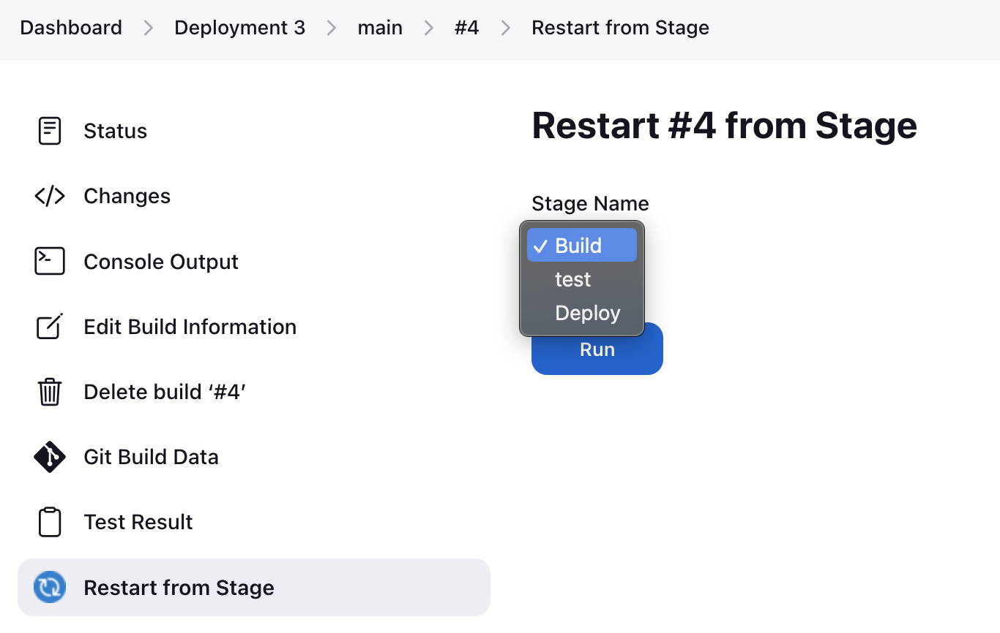

The Story
---------

We’re a tech start-up company with a URL shortener tool. We have a SLA with Nike to provide them access to our URL shortener. In the SLA, we are only allowed 20 minutes of downtime a year. If anything happens to the URL shortener, we must communicate any incidents to Nike.

Scenario
--------

A new hire was tasked with updating the URL shortener. The new hire committed version 2 of the application to the main branch. Which automatically triggered a build, test, and deploy to the production server, replacing version 1 of the application running on the server.

## Post Mortem

### Incident

An over-permissioned engineer was able to push changes to the Main branch. The code had a defect which resulted in an unhandled exception, and crash in the application. The server returned a 500 error page to the end user.

### Down Time: 6mins

### Resolution

A Site Reliability Engineer was able to look at logs from Elastic Beanstalk and identify the issue with the code. A json object was incorrectly being read with ``json.loads``, which is used to convert a json string to a dictionary. The SRE corrected by using ``json.load``, which is used to convert a json file to a dictionary.


**Resolution improvements**

Rollback build:
6 minutes of down time is a significant portion of the down time allowed per year on certain client's Service Level Agreements. Devops engineers should look to rollback as the first option in case of down time

Option 1: Rollback to a previous build from Jenkins
    - In the Jenkins dashboard, click on your pipeline
    - Select 'main'
    - Click on 'Changes'
    - Select the previous version that was successful
    - Here you can 'Restart from Stage' to select a stage in the pipeline to begin the pipeline at e.g. build, test, deploy
    - You can also click on 'Replay' and it will run the whole pipeline





Option 2: Rollback main branch with git:
If for some reason previous changes are not available in Jenkins, you can reset the main branch to the previous commit hash that was successfully build

```bash
git log
```

find the commit hash you want to revert to as copy the hash


```bash
git reset 4707109f1a8c16e164be4b2947b654978d8816b4
```

```bash
git push -f 
```

This will trigger a build and deploy

** It maybe a good idea to cut a branch off main before doing a reset so that you still have access to the commits that come after the hash you've reset to

### Suggested Remediation

**Integration approval process**
Commits and merges into the main branch should require a pull request and successful Jenkins test and build.

- Task: Add Branch Protection Rule
  - Navigate to the repositories GitHub settings
  - Click on 'Branches'
  - Click on 'Branch Protection rules'
  - Add the settings included in below and click 'Create' after selection


**Knowing builds will fail before deploying**
Configure behaviors on Jenkins to let Devops and Engineers know the state of PR branch build and branch integrations into Main.

- Task: Configure Jenkins to only build branches with a Pull Request
  - Navigate to the Jenkins Dashboard
  - Select the pipeline for this application
  - Click configuration
  - Under "Behaviors" configure the following strategies:


- The first behavior will tell Jenkins to only build branches with pull requests. The second behavior will tell Jenkins to build a branch with a PR on it's own and build the result of merging the PR branch into main
